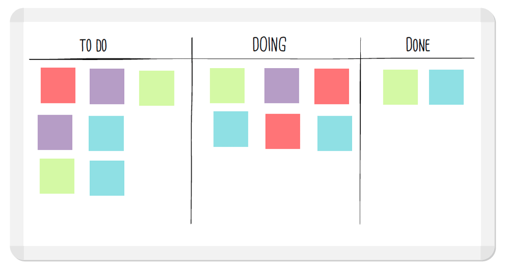

Wellcome to the **TodoNotion** page!

**todonotion** is a terminal based utility that simulate kanban boards inside Notion Task Lists

Getting Started

## Feature overview



### Simple usage

With commands like *new*, *mv*, *ls*, *del*, etc... You can manage your task cards without leaving the terminal!

<--->

### Multiple platforms

todonotion is a golang binary, that have support for linux, mac and windows! Check it out the **releases** page.

<--->

### Easy setup

You only need to two environment variables to get **todonotion** working. See in **Getting Started**.


